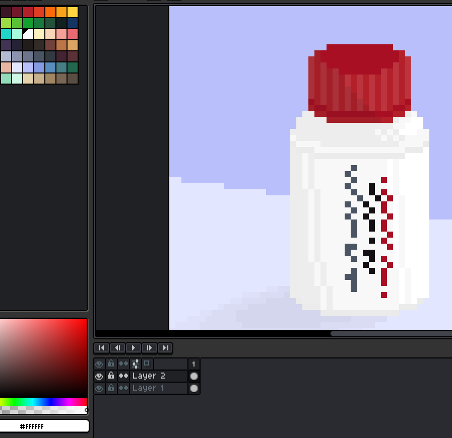
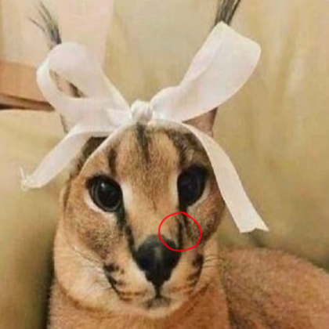
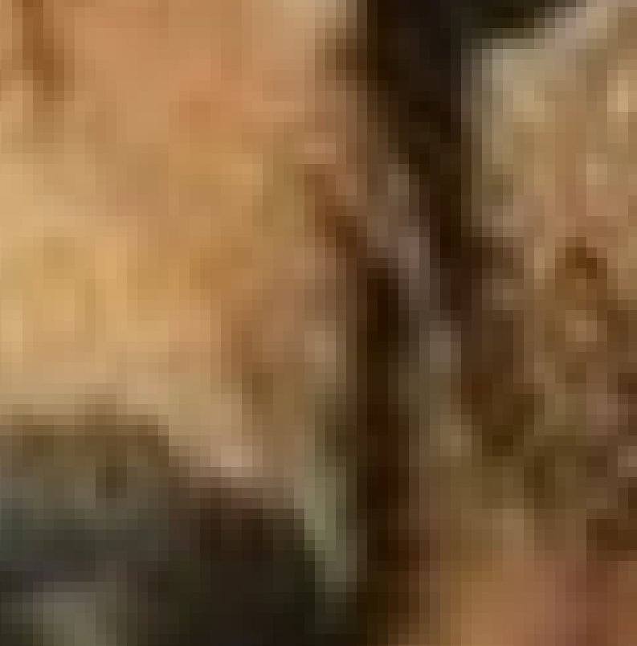

# Les bases du Pixel Art 

>Interface d'Aseprite

## 1. Savoir la différence entre le pixel art et l'art normal
Le pixel art se démarque des autres formes d'art par le fait que, contrairement au dessin traditionnel, il est possible de le créer à la manière de  tuiles aux contours définis qui s'emboîtent les unes dans les autres. Cette caractéristique du Pixel art permet  une  illustration simpliste de même qu'une certaine sorte de charme qui lui est propre.

 

>Pas du pixel art!

