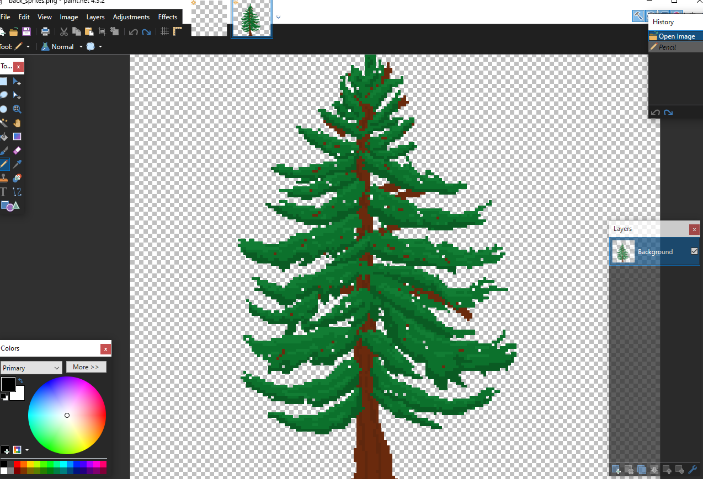

# Les bases du Pixel Art 

>Interface d'Aseprite

## 1. Savoir la différence entre le pixel art et l'art normal
Le pixel art se démarque des autres formes d'art par le fait que, contrairement au dessin traditionnel, il est possible de le créer à la manière de tuiles aux contours définis qui s'emboîtent les unes dans les autres. Cette caractéristique du Pixel art permet  une  illustration simpliste de même qu'une certaine sorte de charme qui lui est propre.

 

>Pas du pixel art!

## 2. Quel logiciel utiliser?

Puisque le pixel art est une forme d'art simple, tout ce qu'il faut est un zoom et un outil crayon.

### MS Paint

>Le minimum, mais pourquoi?

### paint.net

>Une alternative acceptable à Photoshop

### Photoshop

>Bon logiciel pour l'art en général, mais coûte cher

### Aseprite

>Je promet que je ne suis pas payé par Aseprite

## 3. Dessiner
Je recommande de commencer avec un dessin petit. Le plus gros l'illustration est, le plus long et complexe il sera à réaliser.

### Créer le contour
Comme si tu dessinais sur une feuille.

### Rendre le contour plus propre
Chaque ligne doit avoir une épaisseur de 1 pixel et enlever les pixels errants.

### Ajouter de la couleur
Suivre une palette de couleur.

## 4. Regarder des tutoriels
Ce tutoriel ne contient pas tout ce qu'il faut savoir! Si tu veut avoir de la meilleure technique, trouve des tutoriels fait par des professionels!

## 5. Pratiquer!
Le plus on se pratique, le plus on est habile! Dessine des objets autour de toi si tu ne sait pas quoi faire!
